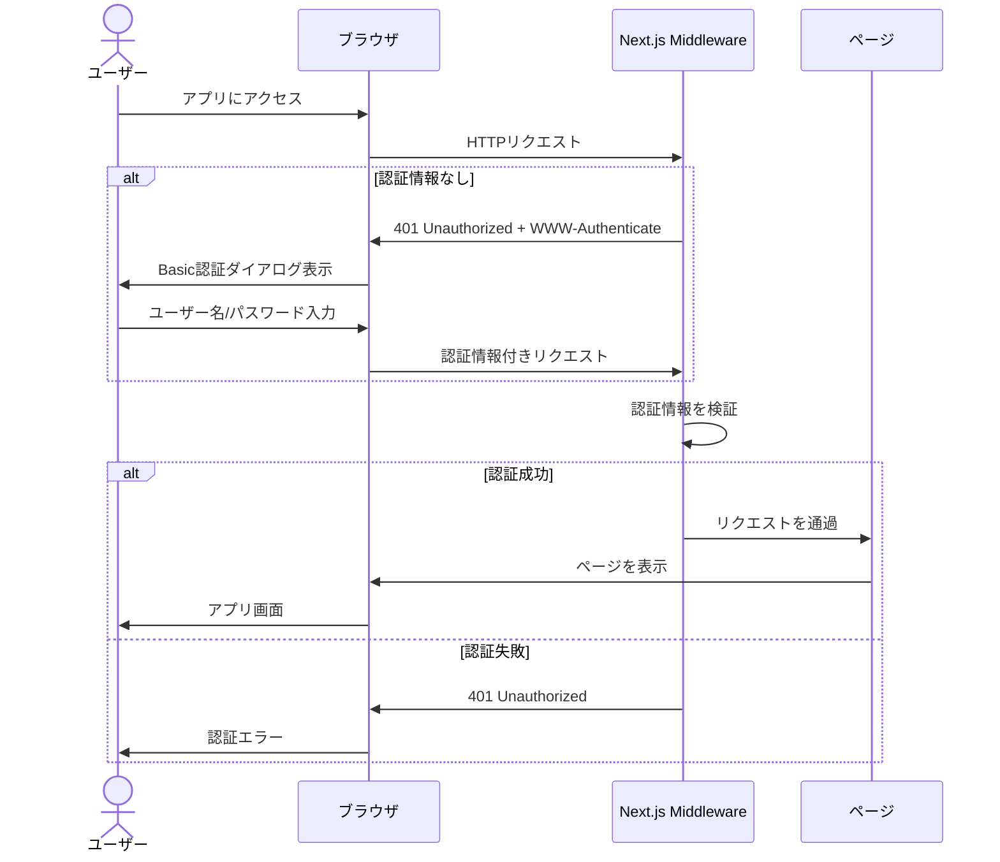
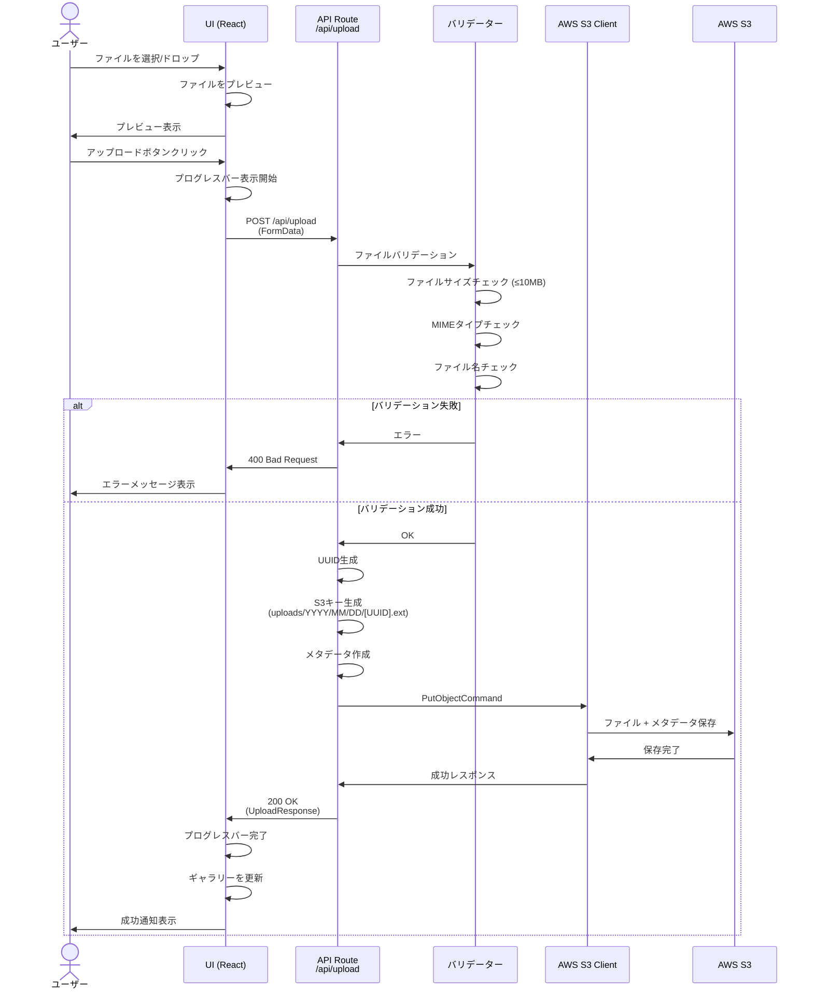
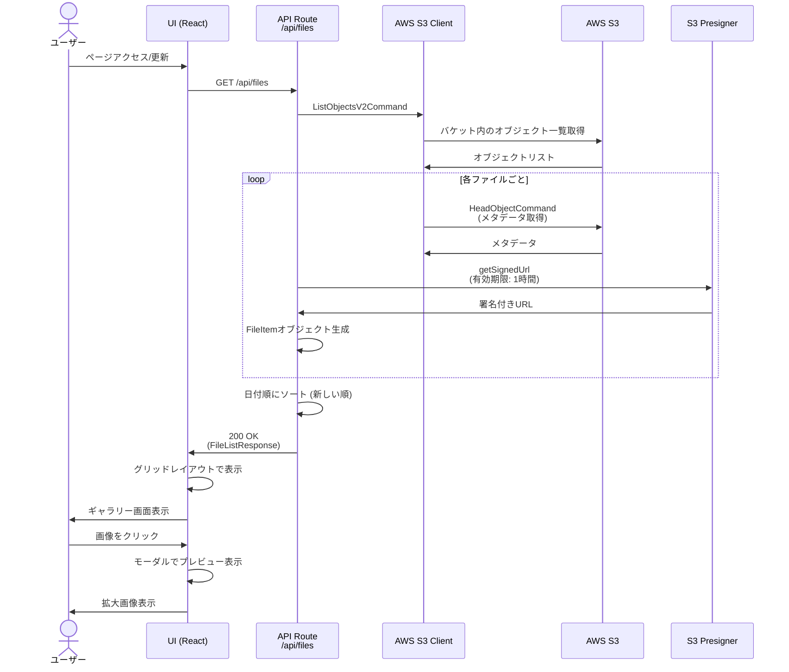
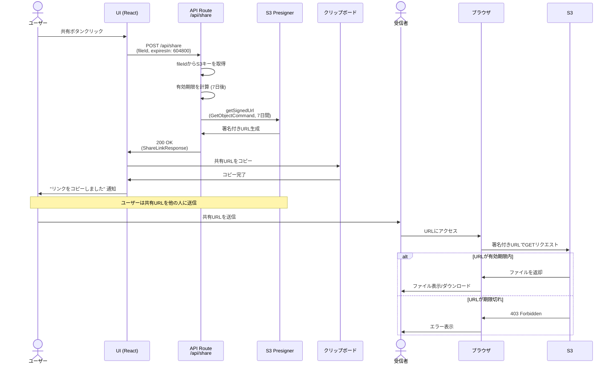
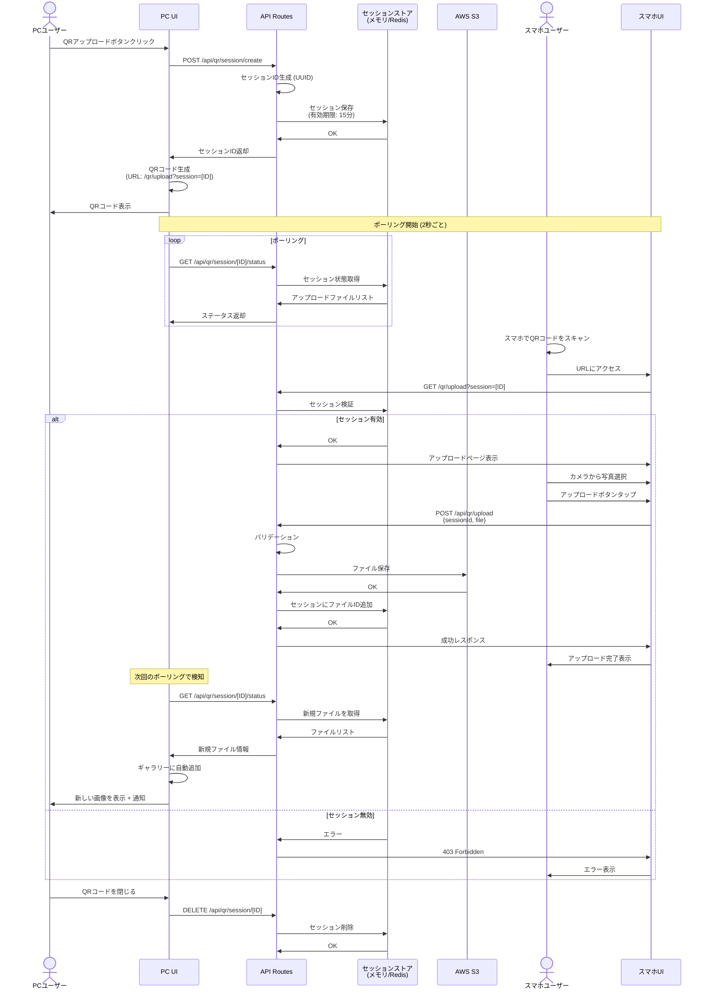
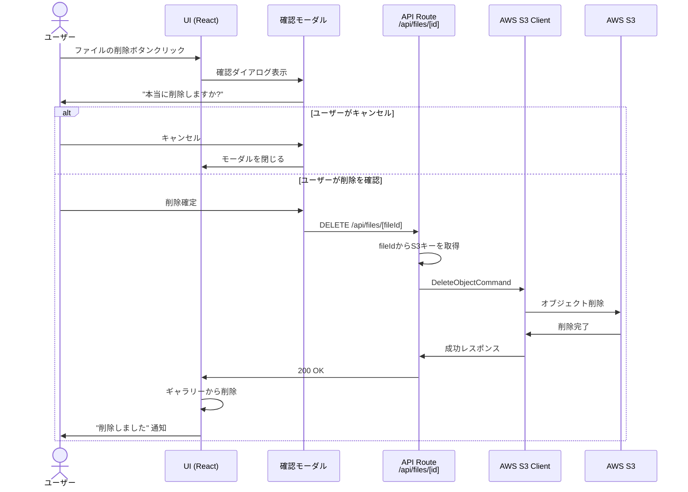
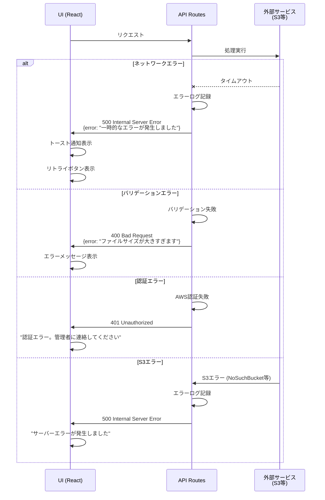
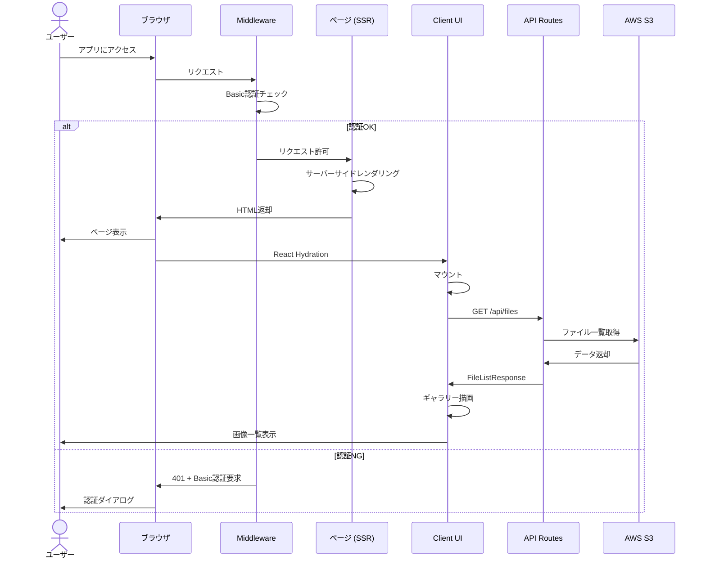

# SnapShare - シーケンス図

## 📌 概要

SnapShareの主要機能のシーケンス図をMermaid形式で記載します。

---

## 🔐 1. Basic認証フロー

ユーザーがアプリにアクセスする際の認証フロー

---

## 📤 2. ファイルアップロードフロー

ユーザーが画像をアップロードするフロー

---

## 🖼 3. ギャラリー表示フロー

アップロード済みファイル一覧を取得・表示するフロー

---

## 🔗 4. 共有リンク生成フロー

ファイルの共有リンクを生成するフロー

---

## 📱 5. QRコード経由アップロードフロー（フェーズ2）

PC画面にQRコードを表示し、スマホからアップロードするフロー

---

## 🗑 6. ファイル削除フロー（フェーズ2）

アップロードしたファイルを削除するフロー

---

## 🔄 7. エラーハンドリングフロー

エラー発生時の共通フロー

---

## 📊 8. ページロードフロー（全体像）

アプリ起動時の全体フロー

---

## 📝 シーケンス図の読み方

### 参加者（Participant）

- **User / PCユーザー / スマホユーザー**: エンドユーザー
- **UI / PCUI / MobileUI**: フロントエンド（React コンポーネント）
- **Middleware**: Next.js Middleware（Basic認証等）
- **API / API Routes**: Next.js API Routes（バックエンド）
- **S3Client**: AWS SDK for JavaScript v3のS3クライアント
- **S3 / AWS S3**: AWS S3サービス
- **Presigner**: S3の署名付きURL生成モジュール
- **SessionStore**: QRセッション情報の保存先（メモリまたはRedis）

### 矢印の意味

- `->`: 同期リクエスト
- `-->`: 非同期レスポンス
- `--x`: エラー
- `Note over`: コメント

### alt / else / loop

- `alt ... else`: 条件分岐
- `loop`: 繰り返し処理

---

## 🔧 実装時の参照

実装時は各シーケンス図を参照しながら、以下を確認してください：

1. ✅ 各APIエンドポイントのリクエスト/レスポンス形式
2. ✅ エラーハンドリングのパターン
3. ✅ ユーザーへのフィードバックタイミング
4. ✅ 外部サービス（S3）との連携ポイント

---

## 📅 更新履歴

- 2025-11-16: 初版作成
